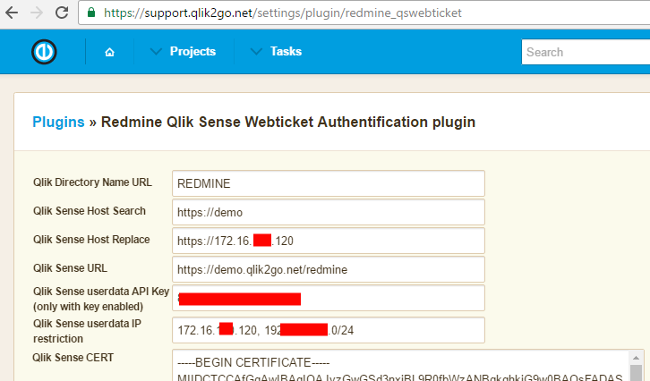
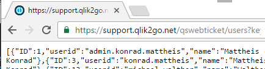
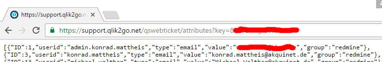

# Install the redmine Plugin

## First fetch the Plugin
```
cd [redminedir]/plugins
git clone https://github.com/konne/redmine_qswebticket
```
Restart the ruby / rails server.

## Second config the Plugin

| Setting                  | Description |
| ------------------------ | ------------- |
| Qlik Directory Name URL  | The name of the Custom Userdirector (for example: REDMINE)  |
| Qlik Sense Host Search   |   |
| Qlik Sense Host Replace  |   |
| Qlik Sense URL           | The URL of the Qlik Sense System without /hub or /qmc. You have to add a second virtuals proxy with an own name. |
| Qlik Sense userdata API Key | The plugin offers all user datas and attributes with a rest api. To enable the endpoint you have to fill in an API Key |
| Qlik Sense CERT           | The Client Cert for the authentification of the redmine plugin against the Qlik Sense Server. You have to fill the conten of the client.pem and the client_key.pem from that directory C:\ProgramData\Qlik\Sense\Repository\Exported Certificates\.Local Certificates\ to that field.




## Third test the REST API




