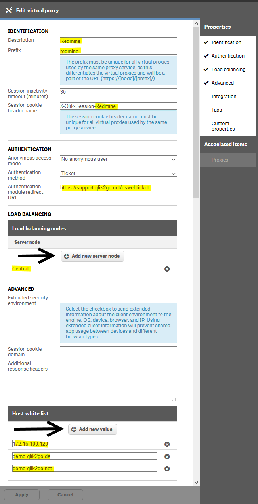

# Install Sense Proxy

Add a virtula Proxy and fill in the yellow marked boxes with your
corresponding entries.
For the Websocketorigin whitlelist it can be one ore more entries.

The "Sesseion cockie header name" can be anything what you like.
I prefer to let the first part with X-Qlik-Session and
add than the prefix of the virtual proxy, but this can be also
somethink complete else.

