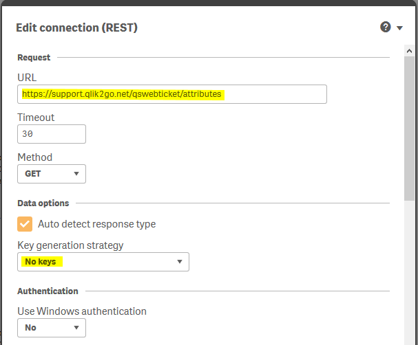
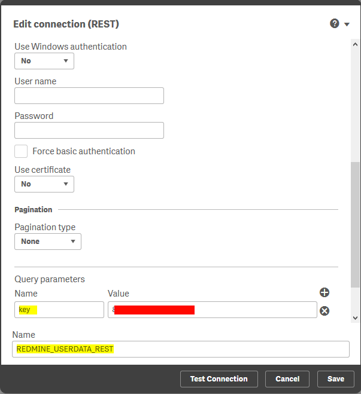
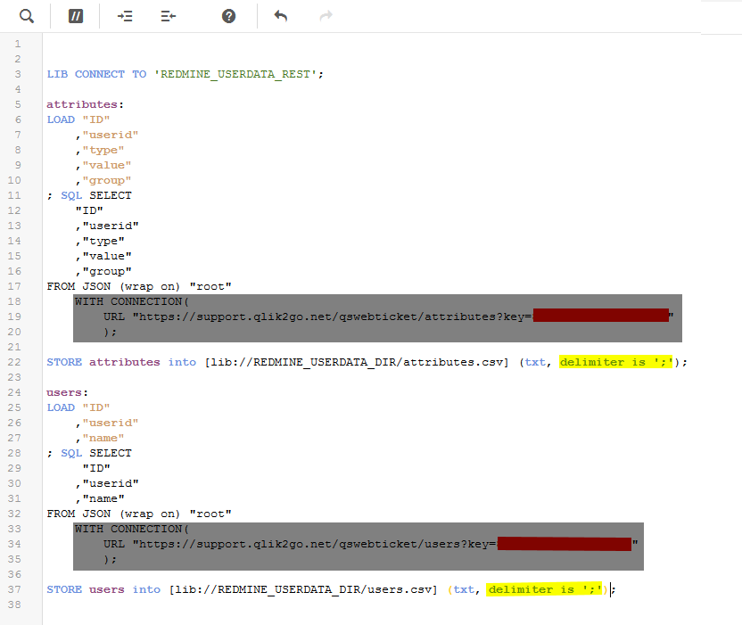
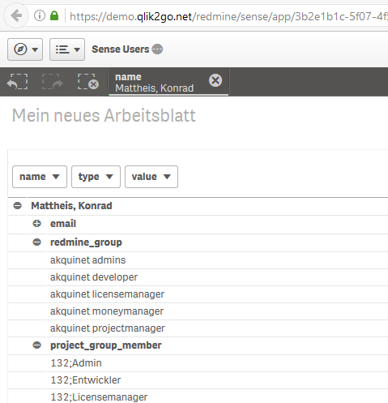
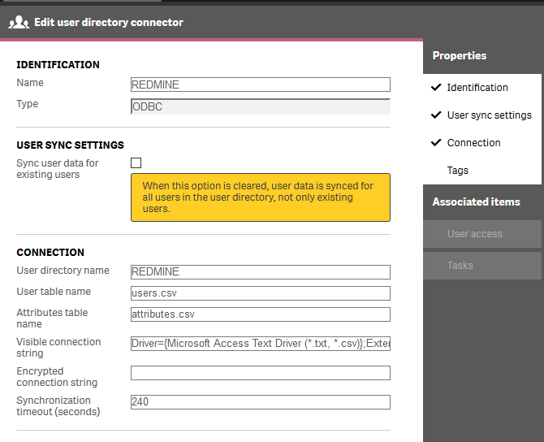

# Install Sense UDC (User Directory Connector)

## First install the ODBC Text Driver

Download the actual Microsoft Access Runtime.
At the moment this is 2016.

[LINK](https://www.microsoft.com/de-DE/download/details.aspx?id=50040)

## Second install ETL App and generate Files

1. Create a directory there you store the users and the attributes files
2. Create a new Empty app
3. Create a Connection to that directory
4. Create a REST Connection to the REST Datasource
   
   
5. Add the following (modified) script.
   Very important is the yellow marked point. That you save the files
   with a semicolon as the separator. Otherwise you run into problems
   on different cultures, because the comma and point have different
   meanings for example in the english and in the german culture.
   
   You have here two possibilities. One is to create two differenet
   dataconnection one for the userdata and one for the attributes.
   Here you can remove the the gray blocks. The other way is to use
   only one dataconnection and override the url with the apikey with
   the URL setting.
   


```SQL
LIB CONNECT TO 'REDMINE_USERDATA_REST';

attributes:
LOAD "ID"
	,"userid"
	,"type"
    ,"value"
	,"group"
; SQL SELECT 
	"ID"
	,"userid"
	,"type"
	,"value"
	,"group"
FROM JSON (wrap on) "root"
	WITH CONNECTION(
    	URL "https://support.qlik2go.net/qswebticket/attributes?key=876324kkjhsadasdASD"
        );

STORE attributes into [lib://REDMINE_USERDATA_DIR/attributes.csv] (txt, delimiter is ';');

users:
LOAD "ID"
	,"userid"
	,"name"
; SQL SELECT 
	 "ID"
	,"userid"
	,"name"
FROM JSON (wrap on) "root"
	WITH CONNECTION(
    	URL "https://support.qlik2go.net/qswebticket/users?key=876324kkjhsadasdASD"
        );

STORE users into [lib://REDMINE_USERDATA_DIR/users.csv] (txt, delimiter is ';');

```

If you like you can add in the app also a simple pivot table to analyse per user
the attributes. This make sometimes debugging of security configs much easier.

 

## Third settings.ini

Now we come bigest obstacle what we had so solve.
The [schema.ini](https://msdn.microsoft.com/en-us/library/ms709353(v=vs.85).aspx) in the directory
of the text database is the description of the layout of the database in the text files.
You need this file because otherwise userid with names like E08020 are intepreted in
the default as number and second to fix the UTF8 issue. Qlik stores txt files always in
UTF8 but if you read the documentation of the settings.ini or try to use the odbc
configuration dialog you don't find the possible to chosse utf8. Also the simple try
to put in UTF8 or UTF-8 as CharacterSet is not working, but if you remember that any
characterset in windows has a number you get it working with CharacterSet=65001.

You have to only copy the folling text as schema.ini into the directory of the users and attributes text files

```
[attributes.csv]
ColNameHeader=True
Format=Delimited(;)
MaxScanRows=25
CharacterSet=65001
Col1=ID Integer
Col2=USERID Char Width 255
Col3=TYPE Char Width 255
Col4=VALUE Char Width 255
Col5=GROUP Char Width 255
[users.csv]
ColNameHeader=True
Format=Delimited(;)
MaxScanRows=25
CharacterSet=65001
Col1=ID Integer
Col2=USERID Char Width 255
Col3=NAME Char Width 255
```


## Fourth install UDC

Connection String:
```
Driver={Microsoft Access Text Driver (*.txt, *.csv)};Extensions=csv;Dbq=C:\PATH_TO_YOUR_CSVS;
```


